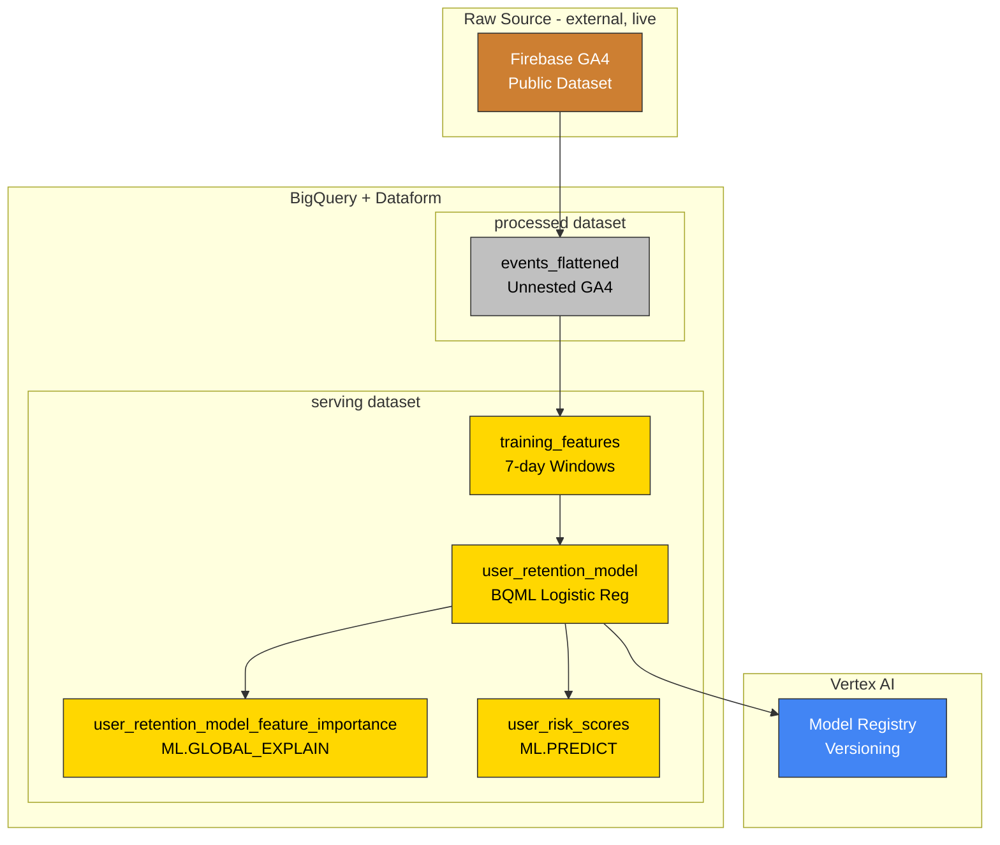
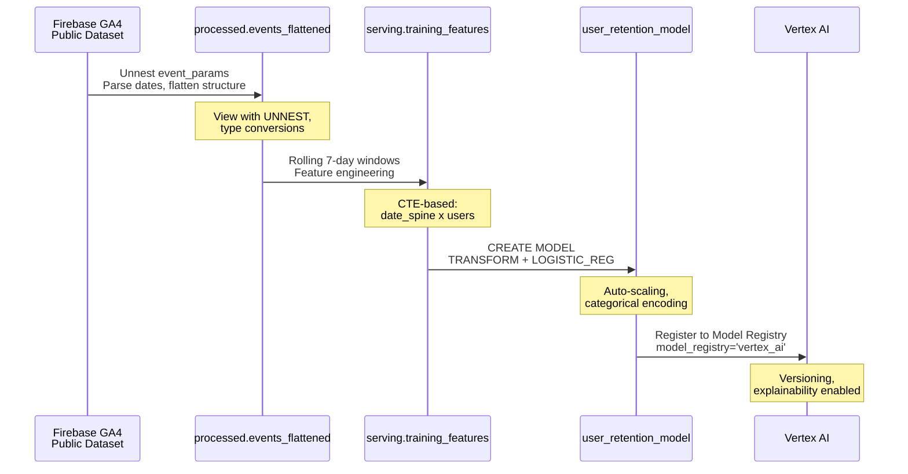

# Churn Prediction Architecture

Data flow and pipeline structure for user retention modeling with BigQuery ML.

---

## Pipeline Overview



---

## Data Flow



---

## Key Components

| Stage | Table | Purpose |
|-------|-------|---------|
| Raw (external) | `events_*` | Raw GA4 events (external declaration, live public dataset) |
| processed | `events_flattened` | Unnested event parameters |
| serving | `training_features` | Rolling 7-day window features |
| serving | `user_retention_model` | Trained logistic regression |
| serving | `user_retention_model_feature_importance` | Feature weights via ML.GLOBAL_EXPLAIN |
| serving | `user_risk_scores` | Materialized predictions |

---

## Feature Engineering

Uses **rolling 7-day windows** instead of static "first 7 days":

```
User A, Week 1: Days 1-7   → Did they return Days 8-14?
User A, Week 2: Days 8-14  → Did they return Days 15-21?
User A, Week 3: Days 15-21 → Did they return Days 22-28?
```

This creates multiple training rows per user, capturing behavioral dynamics over time.

---

## Navigation

[Guide](01-features.md) | [Quick Reference](quick.md) | [Repo README](../README.md)
